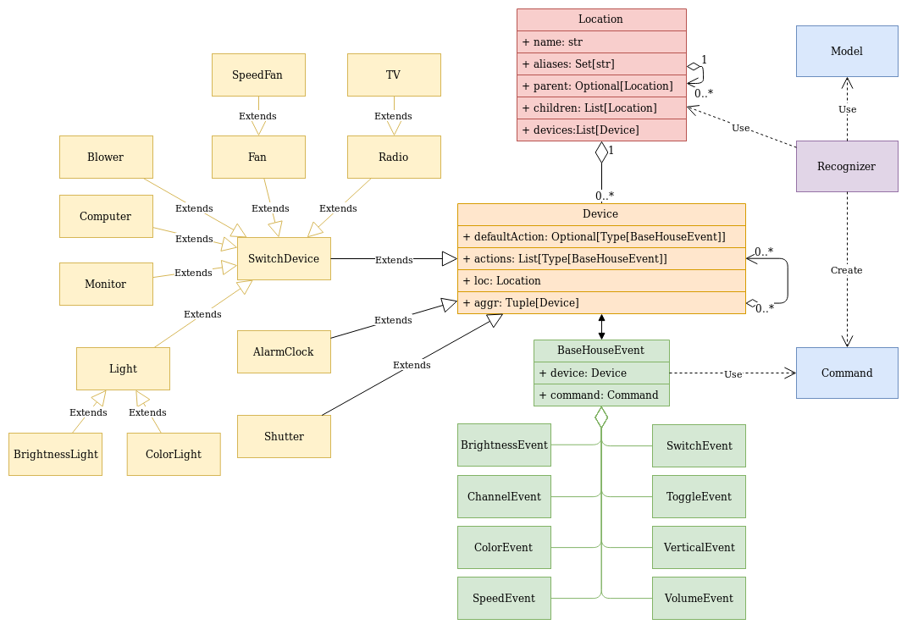

# Spis treści
- [Cel projektu](#cel-projektu)
- [Opis dzialania](#opis-dzialania)
    + [Opis lokalizacji](#opis-lokalizacji)
    + [Opis urzadzen](#opis-urzadzen)
    + [Opis akcji](#opis-akcji)
- [Diagram klas](#diagram-klas)
- [Przygotowanie programu](#przygotowanie)
    + [Git repository](#git-repository)
    + [Python environment](#python-environment)

# Cel projektu
Projekt ma dostarczyć narzędzie do obsługi urządzeń w domu za pomocą 
wypowiadanych poleceń. Celem jest przetworzenie tekstu na odpowiadającą mu
akcję.


# Opis dzialania
Komenda do przetworzenia jest analizowana w następujący sposób:
- wykrywane są możliwe rodzaje poleceń - przypisywana jest odpowiednia waga
- wykrywane są możliwe miejsca, do którego odwołuje się polecenie - przypisywana jest odpowiednia waga
- wykrywane są możliwe urządzenia, przydzielana jest ocena bazująca na następujących właściwościach (od najbardziej istotnych):
    - czy urządzenie zwróciło wartość twierdzącą dla odpowiedniej komendy (domyślnie tak)
    - liczba pokrywających się słów z opisu urządzenia i komendy, ale bez słów opisujących miejsce
    - uwzględnia czy lokalizacja jest na liście możliwych miejsc
    - uwzględnia czy urządzenie jest w tym samym pomieszczeniu co wypowiadający polecenie   
    - poziom zagłębienia w lokalizacji - bardziej 
- wybierany jest rodzaj akcji z największą wagą
    - gdy jest kilka takich urządzeń, pierwszeństwo mają akcje, które są możliwe do wykonania na możliwych urządzeniach
    - gdy nie znaleziono żadnej akcji, wyszukiwane jest urządzenie, gdy urządzenie ma zdefiniowaną domyślną akcje jest ona wybierana
- wybierane jest urządzenie z największą wagą
    - gdy jest kilka takich urządzeń, pierwszeństwo mają urządzenia agregujące
    - gdy nie znaleziono żadnego urządzenia, a możliwa lokalizacja jest tylko jedna:
        - gdy jest jedno urządzenie, jest ono wybierane
        - filtrowane są urządzenia mające możliwą akcje, jeśli jest tylko jedno takie, jest ono wybierane    
    
### Opis lokalizacji
Jest określana za pomocą nazwy, mogą być użyte alternatywne określenia.
Lokalizacja może zawierać podrzędne lokalizacje oraz urządzenia w danej lokalizacji.


### Opis urzadzen
Jest określane za pomocą nazwy, mogą być użyte alternatywne określenia.
Urządzenie Musi zawierać listę akcji jakie może wykonać.
Może mieć przypisaną domyślną akcję np. przełącz (on->off, off->on).
Może agregować podrzędne urządzenia - wymagane jest by agregowane urządzenia posiadały ten sam typ.

W celu odróżnienia np. `lampa` od `lampa lewa` można ustawić dodatkowe 
flagi określający wymagany wyraz albo wyraz który nie może się pojawić.
Zamiast jednego słowa można podać listę takich słów. Słowo które nie może się pojawić
konfiguruje się przez dodanie na początku znaku `!`.
Dla powyższego przykładu należy ustawić odpowiednio `lewa` oraz `!lewa` 

Rozszerzenie urządzeń polega na dziedziczeniu z klasy bazowej `Device`
i ustawieniu odpowiednich wartości w metodach inicjujących np.:
```
class AlarClock(Device):
    def initActions(self):
        super().initActions()
        self.actions.append(SwitchEvent)
        self.actions.append(TimeEvent)
        self.defaultAction = SwitchEvent

    def initAliases(self):
        super().initAliases()
        self.aliases.add('budzik')
        self.aliases.add('budzenie')
``` 
### Opis akcji
Akcje posiadają specjalny zbiór słów, dzięki którym akcja jest rozpoznawana. 
Zbiory te mogą być podzielone na mniejsze grupy, dzięki temu możliwe jest 
rozpoznanie odpowiednich parametrów.
Np. klasa obsługująca zmianę kanału, może pozyskać dodatkowe informacje 
zależnie od rozpoznanej grupy:
```
class ChannelEvent(BaseHouseEvent):
    aliases = AliasSet('kanał', 'poprzedni', 'następny')
```
Rozszerzanie akcji polega na dodaniu do modułu event nowej akcji. 
Akcje te są ładowane dynamicznie. 

# Diagram klas


# Przygotowanie programu

### Git repository
Wymagany jest plik zawierający pogrupowane słowa.
```shell script
git submodule init
git submodule update
```

### Python environment
Requirement python>=3.8
```shell script
python -m venv house_control_env
source ./house_control_env/bin/activate
pip install -r requirements.txt
```

